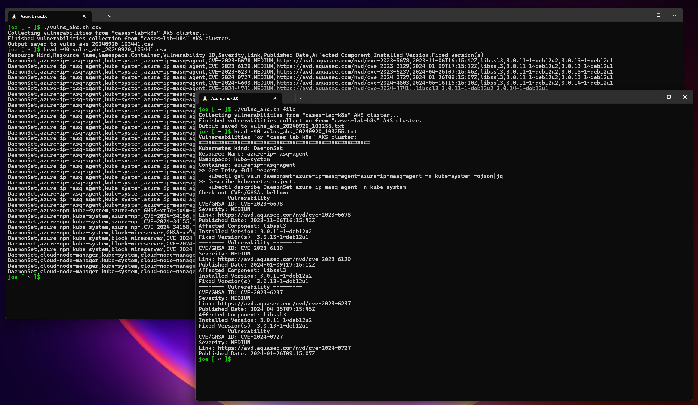

  
  
***Bash shell script to parse data from Trivy Operator running on an AKS cluster.***
  
  
Key features:
* This script will list all vulnerabilities found by Trivy Operator in AKS clusters;  
* It will list the CVE/GHSA ID, Severity, Link, Published Date, Resource, Installed Version, Fixed Version(s);  
* It will show the Kubernetes Kind, Resource Name, Namespace, Container;  
* On pretty/file mode will also provide the command to get the full Trivy report and the command to describe the affected Kubernetes object.  
  
  
  
Requirements:
* Trivy Operator running on AKS cluster:  
    Overview: https://aquasecurity.github.io/trivy-operator/v0.22.0/  
    Install using Helm: https://aquasecurity.github.io/trivy-operator/v0.22.0/getting-started/installation/helm/  
    Install using kubectl: https://aquasecurity.github.io/trivy-operator/v0.22.0/getting-started/installation/kubectl/  

* kubectl command:  
    https://kubernetes.io/docs/tasks/tools/install-kubectl  
    https://docs.microsoft.com/en-us/cli/azure/install-azure-cli  
    After having Azure CLI use `az aks install-cli` to install kubectl and kubelogin  

* jq command:  
    https://jqlang.github.io/jq/download  
    Ubuntu: `sudo apt install jq`  
    Azure Linux: `sudo tdnf install jq`  

* sed command:  
    Ubuntu: `sudo apt install sed`  
    AzureLinux: `sudo tdnf install sed`  
  
Trivy Operator deployment:  
* Helm:  
  - Add Aqua chart repository: `helm repo add aqua https://aquasecurity.github.io/helm-charts/` 
  - Update helm repos: `helm repo update` 
  - Install: `helm install trivy-operator aqua/trivy-operator --namespace trivy-system --create-namespace --set="trivy.ignoreUnfixed=true"`  
  
* Yaml: `kubectl apply -f https://raw.githubusercontent.com/aquasecurity/trivy-operator/v0.22.0/deploy/static/trivy-operator.yaml` 
  
  
Usage:  
1. Download: `wget https://raw.githubusercontent.com/josecaneira/aks-lab/main/trivy_operator_parser/vulns_aks.sh`  
2. Change permissions: `chmod u+x vulns_aks.sh`  
3. Run: `./vulns_aks.sh [file|csv]`  

***Latest Version: 0.10.1***

CHANGELOG:  
* 18/09/2024 - 0.10 :
  - Initial release.  
* 20/09/2024 - 0.10.1:
  - Minor bug correction where cluster name variable was being printed before being initialized;
  - installedVersion also needed to be escaped to avoid CSV issues;
  - replaced tr by sed on escaping commas;
  - Updates to README.md to reflect up to date version in the links.
* 30/10/2024 - 0.10.2:
  - Added AKS cluster name to the output filename.

TODO: Include other available Trivy fields in outputs.

__________________________________________________________________________________________________________________________________________________________________________________________________________
